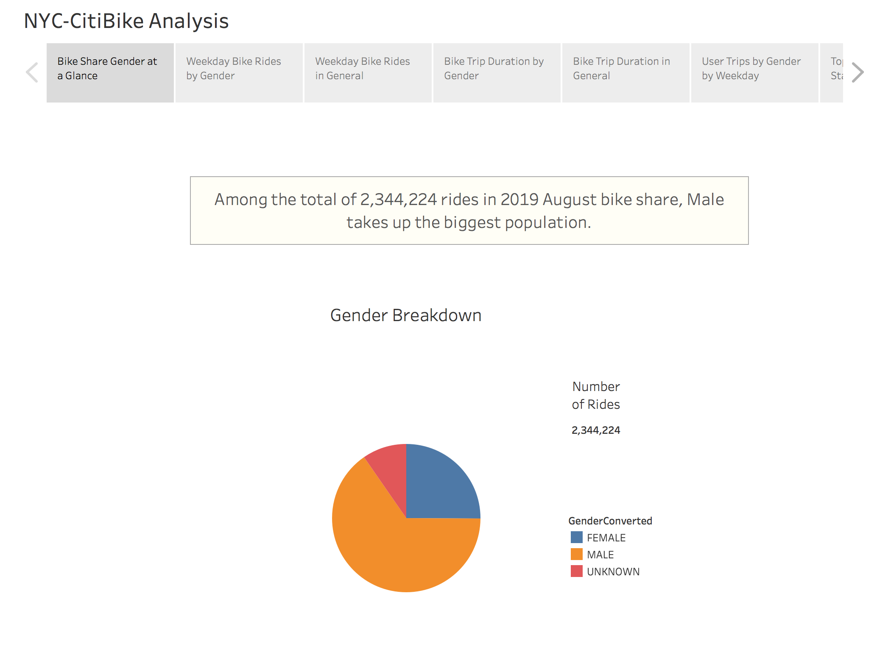
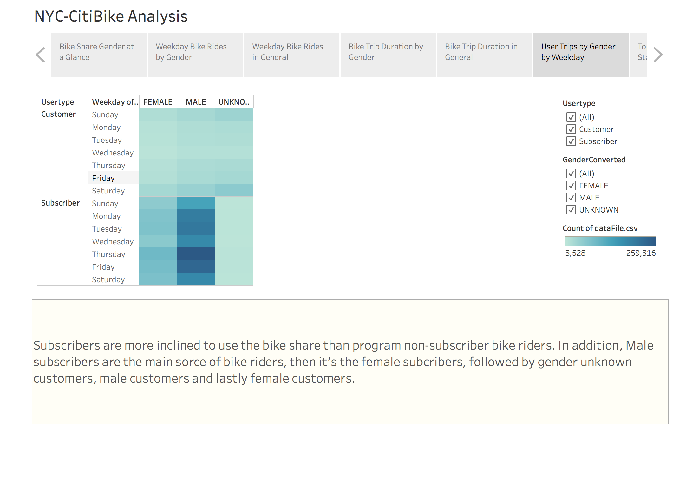

# Bike-Sharing

## NYC CitiBike Program Overview
The analysis is performed based on NYC CitiBike Share program. The goal is to demonstrate how the bike share program works and the benefits of it. The bike-share program can be utilized to make the commute more convenient for people living in the city, and for travelers to enjoy every corner of the city.

The analysis of this Bikeshare project is to provide as many aspects as possible for a bike-sharing program to solidify a proposal to convince the investors that a program as such will be a popular lifestyle choice and therefore a great investment in the city of Des Moines.

## Results
Below are the visualizations created in a tableau story and descriptions alongside to demonstrate the data on the CitiBike Share program in NYC.

Graph 1:

*Among the total of 2,344,224 rides in 2019 August bike share, Male takes up the biggest population.*

 

Graph 2:

*The differences among different gender bike rides are mainly from Monday to Friday between 6 am - 10 am and 4 pm to 9 pm. During which, the number of male riders is significantly higher than the other genders.*

 

Graph 3:

*In general, the bike rides from Monday to Friday are mainly during morning and afternoon rush hours for work. While weekend bike rides are most popular during the mid-day between 11 am to 4 pm.*

 

Graph 4:

*Bike rides happen most popular for riding time within half an hour (30 min). Male peaked at the total number of rides of 108,087 on 5-min trips, followed by the female with a peak total of 34,151 rides for trips about 6-min long. Followed by unknown gender riders.*

 

Graph 5:

*And in general, bike riders have the highest number of rides (146,752 rides in total) for 5 min trips as shown in the graph.*

 

Graph 6:

*Subscribers are more inclined to use the bike share than program non-subscriber bike riders. Besides, Male subscribers are the main source of bike riders, then it's the female subscribers, followed by gender unknown customers, male customers, and lastly female customers.*

 

Graph 7:

*Based on the frequency of each bikeID being used, maintenance services can be performed prioritizing the heavily used ones first to keep the bikes in good condition.*

## Summary

Based on the analysis from above, there are differences among genders, types of riders, peak periods of bike share during the week, duration of the bike rides, and frequency of bikes being used.

Using the data from the analysis, the bike-share program can better target their intended audience. Also, to optimize the distribution of the bikes in different areas, two more graphs are created with station names listed when hovering over the circles in tableau to gather station information about the most popular trip starting points and most popular trip ending points. On the bike share user end, if the bike share app shares information about the busiest trip starting and ending stations, they can choose to avoid those stations to have a hassle-free experience retrieving or returning bikes.

 

Additional Graph A:

*By using the tooltip on the map, bike riders can better avoid the busiest stations to start their trip.*

 

Additional Graph B:

*And by using the tooltip on the map, bike riders can also better avoid the busiest stations to end their trip.*

 
https://public.tableau.com/app/profile/ylia.rosario/viz/Bikesharing_16534339841020/TopStartStations#1
